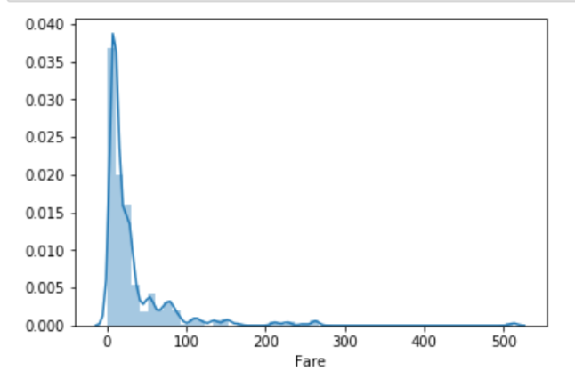
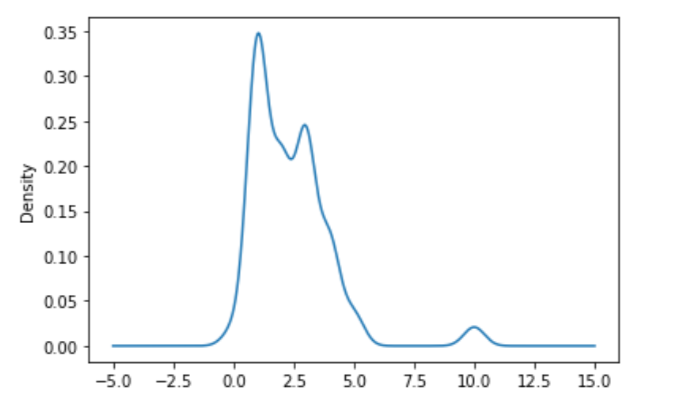
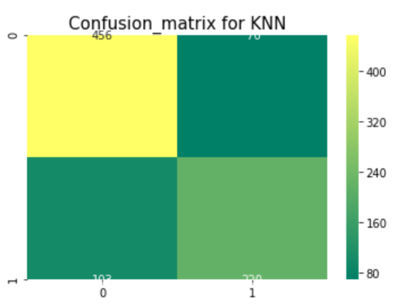

# Kaggle's Titanic Challenge
My analysis for the 'Titanic: Machine Learning from Disaster' competition, hosted by Kaggle.com
(Performed as a part of Coursework under Object Oriented Programming ECL-205)

## About the Problem
The Titanic Problem is based on the sinking of the ‘Unsinkable’ ship Titanic in the early 1912. It gives us information about numerous passengers like their ages, sexes, sibling counts, embarkment points and whether or not they survived the disaster. Based on these features, you have to predict if an arbitrary passenger on Titanic would survive the sinking.

## Libraries Used
- *Numpy*
- *Pandas*
- *Seaborn*
- *Matplotlib*
- *Sklearn*

## Methodology
- Importing the libraries.
```
...
import pandas as pd
from sklearn import tree
from sklearn.svm import SVC
from sklearn import linear_model
from sklearn.linear_model import LogisticRegression
from sklearn.model_selection import train_test_split
from sklearn.neighbors import KNeighborsClassifier
from sklearn import preprocessing
...
```
- Getting the Data
```
train = pd.read_csv(r'C:\Users\Rishabh\Downloads\titanic (1)\train.csv')
test = pd.read_csv(r"C:\Users\Rishabh\Downloads\titanic (1)\test.csv")
```

- Data Analysis
```
sns.distplot(train['Fare'])
plt.show()
```



- Data Preprocessing
```
train.loc[train["Sex"]=="male","Sex"]=0
train.loc[train["Sex"]=="female","Sex"]=1
```
- Imputing Median values
```
train["Fare"] = train["Fare"].fillna(train["Fare"].median())
```     



- Creating New Features
```
for i in [train, test]:
        i['Fam_Size'] = np.where((i['SibSp']+i['Parch']) == 0 , 1,
                            np.where((i['SibSp']+i['Parch']) <= 3,2, 3))
        del i['SibSp']
        del i['Parch']
```
- Dropping Irrelevant Features
```
train = train.drop(['Ticket'], axis=1)
test = test.drop(['Ticket'], axis=1)
```
- Building Machine Learning Models: Logistic Regression, Second degree Logistic Regression, KNN Classifier and the Random Forest Classifier.
```
x=train.iloc[:,1:9]
y=train.iloc[:,0]

X_train, X_test, y_train, y_test = train_test_split(x, y,test_size = 42,random_state=0)

classifier=KNeighborsClassifier(n_neighbors=7)
classifier.fit(X_train,y_train)
```
- Checking for Model Accuracy and Looking at Confusion Matrices
```
y_pred = cross_val_predict(classifier,X_train,y_train,cv=10)
print(classifier.score(X_test,y_test))
prediction = classifier.predict(test)

sns.heatmap(confusion_matrix(y_train,y_pred),annot=True,fmt='3.0f',cmap="summer")
plt.title('Confusion_matrix for KNN', y=1.05, size=15)

```



- ***The predicted data was saved to a csv file for submission.***
